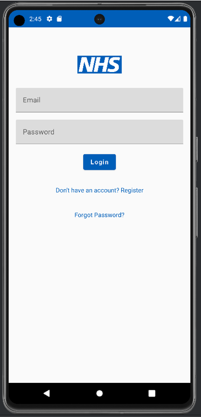

# Clinscribe 1.1 - AI-Driven Medical Transcription Android Application

[](https://github.com/QMQMWANG/Clinscribe-1.1)
[](https://youtu.be/k7C0ZB1e5yY)
[](https://youtu.be/iKyS6HUqGzc)

## Table of Contents
1. [Introduction](#introduction)
2. [Features](#features)
3. [Prerequisite Setup](#prerequisite-setup)
   - [Downloading Required Software](#downloading-required-software)
   - [Setting Up Ollama Application](#setting-up-ollama-application)
   - [Setting Up the Ollama Server](#setting-up-the-ollama-server)
4. [Cloning and Setting Up the Android Application](#cloning-and-setting-up-the-android-application)
   - [Cloning the Repository](#cloning-the-repository)
   - [Building the Application](#building-the-application)
5. [Using the Application](#using-the-application)
   - [Logging In](#logging-in)
   - [Workflow for Recording, Processing, and Managing Clinical Data](#workflow-for-recording-processing-and-managing-clinical-data)
6. [Exporting Data](#exporting-data)
7. [Appendix](#appendix)
8. [Contact Information](#contact-information)

## Introduction

**Clinscribe v1.1** is an AI-driven medical transcription Android application designed to assist healthcare professionals in efficiently recording, processing, and managing clinical data. This application leverages the state-of-the-art **whisper-tiny model** from [whisper.cpp](https://github.com/ggerganov/whisper.cpp) to transcribe conversations into structured FHIR records and generate clinical summaries.

## Features

- **Real-time Transcription:** Record and transcribe clinical conversations on the go using the **whisper-tiny model**, which offers efficient and lightweight transcription capabilities.
- **FHIR Integration:** Automatically convert transcriptions into FHIR JSON records.
- **Clinical Summaries:** Generate clinical summaries from FHIR records.
- **Data Management:** Edit, store, and manage FHIR records within the app.
- **Export Options:** Export transcriptions, summaries, and FHIR records in various formats.
- 

*Login Screen*

*Transcription Successful Screen*


## Prerequisite Setup
### Downloading Required Software
Before starting, ensure that you have the following software installed:

- **[Android Studio](https://developer.android.com/studio):** IDE for building the Android application.
- **[Ollama Application](https://ollama.com/download):** Required to run the language model.
- **[Python 3.11 or higher](https://www.python.org/downloads/):** For running the server script.
- **[Visual Studio Code (VSCode)](https://code.visualstudio.com/):** For editing and running the Python server script.

### Setting Up Ollama Application
1. Open the **Windows Terminal**.
2. Download the `phi3` model by running the following command:
    ```bash
    ollama run phi3
    ```
3. After downloading the model, ensure that the **Ollama application** is open and running in the background.
4. If you want to use a different model, you can explore and select from the available models listed in the [Ollama Model Library](https://ollama.com/library). Use the command below to run a specific model:
    ```bash
    ollama run <model_name>
    ```
    Replace `<model_name>` with the name of the model you want to use.

### Setting Up the Ollama Server
1. Open **Visual Studio Code (VSCode)** and create a new Python file named `ollama_server.py`.
2. Obtain the necessary server code from the [Ollama Server Code](https://github.com/QMQMWANG/Clinscribe-1.1/blob/master/examples/whisper.android/app/src/main/java/com/whispercppdemo/ollama_server/ollama_server_nhs.py). Copy and paste the code into your `ollama_server.py` file.
3. Open a terminal in VSCode and run the following commands to set up a virtual environment and install the required dependencies:
    ```bash
    python -m venv ollama-server
    .\ollama-server\Scripts\Activate
    pip install flask
    pip install ollama
    ```
4. Once the dependencies are installed, run the `ollama_server.py` script by clicking the **Run** icon in VSCode. If the server is successfully started, you should see an output indicating that the Flask server is running.


## Cloning and Setting Up the Android Application
### Cloning the Repository
1. Open **Android Studio** and click on **"Get from Version Control."**
2. Enter the repository URL: `https://github.com/QMQMWANG/Clinscribe-1.1` and choose a directory where you want to clone the project.
3. If **Git** is not installed, Android Studio will prompt you to install it. Follow the instructions to install Git.
4. Once the repository is cloned, navigate to the `examples/whisper.android` directory.

### Building the Application
1. In Android Studio, select the **"release"** mode from the **Build Variants**.
2. Open the **Device Manager** and create a virtual device if you do not have a physical Android device. To deploy the app on a physical Android phone, click on **"Pair device using Wi-Fi"** in the Device Manager.
3. Click on the **"Run"** button in Android Studio to build and deploy the application to your selected device.

## Using the Application
Before launching the application, ensure that the Ollama server is running with the correct output and that the Ollama application is also open.

### Logging In
The application provides two login modes:

- **Standard Online Login:**
  - **Username:** `user@nhs.com`
  - **Password:** `111111`
  
- **Offline Login:**
  - **Username:** `test@t.com`
  - **Password:** `111111`

> **Note:** It is recommended to wait a few seconds after opening the application to ensure that it has fully initialized before attempting to log in.

### Workflow for Recording, Processing, and Managing Clinical Data
1. **Start Recording:** Tap the `Start recording` button to begin capturing the conversation.
2. **Stop Recording:** Tap `Stop recording` to end the session. The transcribed text will be sent to the Ollama server for conversion into FHIR records.
3. **Viewing FHIR JSON Records:** The generated FHIR records will automatically appear on the `FHIR Records` page, where you can review, edit, and store them into the database.


4. **Converting FHIR Records into a Clinical Summary:** Tap the `Convert into Clinical Summary` button to send the FHIR records to the Ollama server, where they will be transformed into a clinical summary. The summary will be displayed on the `Clinical Summary` page, where you can further edit it as needed.
5. **Managing FHIR Records:** Navigate to the `Manage FHIR` screen to search, edit, and delete stored FHIR records directly within the application.


## Exporting Data
### Exporting Transcribed Clinical Conversations and Clinical Summaries
1. Users can export both the transcribed clinical conversations and the clinical summaries as `.doc` files. This can be done by tapping the `Export` icon available in their respective sections.
2. The resulting `.doc` files are stored on the Android device in the following directory:
    ```bash
    /storage/emulated/0/Documents/
    ```

### Exporting FHIR JSON Records to CSV
1. First, open the **Windows Terminal** on your PC and execute the following command:
    ```bash
    adb forward tcp:8080 tcp:8080
    ```
2. Next, open a web browser on your PC and navigate to:
    ```bash
    http://localhost:8080/csv
    ```
    This will initiate the download of the `FhirDatabase.csv` file containing all stored FHIR JSON records.

> **Note:** If you are using a physical Android device, connect both the device and your PC to the same Wi-Fi network. You can then access the CSV file by navigating to `http://DEVICE_IP:8080/csv` in your web browser.

## Appendix
- **[Prerequisite Setup Video](https://youtu.be/k7C0ZB1e5yY):** A detailed guide on setting up the prerequisites.
- **[Demo Video](https://youtu.be/iKyS6HUqGzc):** A comprehensive walkthrough of the application.

## Contact Information
For any queries or support, please contact:  
**Joe Wang**  
Email: [Joewangg@hotmail.com](mailto:Joewangg@hotmail.com)

